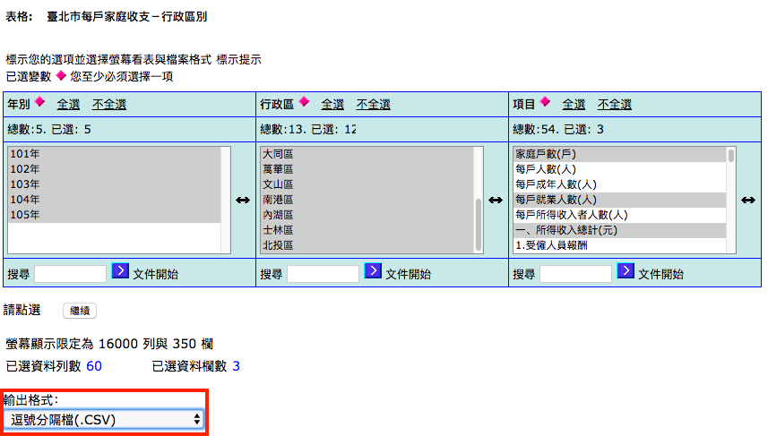

# 資料擷取

## 家戶所得與支出

[臺北市家庭收支資料庫查詢系統](http://210.69.61.217/pxweb2007-tp/dialog/statfile9_FI.asp)

## 手動查詢並下載 csv



## 房價

[內政部地政司房地產交易價格](https://www.land.moi.gov.tw/chhtml/property.asp?cid=830)

## 手動或者寫自動化程式擷取

- 對自動化程式擷取興趣的同學可以參考 [RSelenium](https://cran.r-project.org/web/packages/RSelenium/vignettes/RSelenium-basics.html)

## 自動化程式範例：自訂函數

```{r eval = FALSE}
get_district_data <- function(villages) {
  for (i in 1:length(villages)) {
    remDr$open()
    remDr$navigate("https://www.land.moi.gov.tw/chhtml/property.asp?cid=830")
    webElem <- remDr$findElement(using = 'xpath', value = "//select[@id='city']")
    webElem$clickElement()
    webElem$sendKeysToElement(list("臺北市"))
    webElem <- remDr$findElement(using = 'xpath', value = "//select[@id='village']")
    webElem$clickElement()
    webElem$sendKeysToElement(list(villages[i]))
    webElem$clickElement()
    webElem <- remDr$findElement(using = 'xpath', value = "//select[@id='syear'][1]")
    webElem$clickElement()
    webElem$sendKeysToElement(list('100'))
    webElem$clickElement()
    webElem <- remDr$findElement(using = 'xpath', value = "//select[@id='syear'][2]")
    webElem$clickElement()
    webElem$sendKeysToElement(list('3'))
    webElem$clickElement()
    webElem <- remDr$findElement(using = 'xpath', value = "//select[@id='syear'][3]")
    webElem$clickElement()
    webElem$sendKeysToElement(list('101'))
    webElem$clickElement()
    webElem <- remDr$findElement(using = 'xpath', value = "//select[@id='syear'][4]")
    webElem$clickElement()
    webElem$sendKeysToElement(list('3'))
    webElem$clickElement()
    webElem <- remDr$findElement(using = 'xpath', value = "//input[@class='button'][1]")
    webElem$clickElement()
    window_ids <- unlist(remDr$getWindowHandles())
    new_window_id <- window_ids[2]
    remDr$switchToWindow(new_window_id)
    webElem <- remDr$findElement(using = 'xpath', value = "//input[@id='submit1']")
    webElem$clickElement()
    Sys.sleep(sample(10:20, size = 1))
    remDr$close()
  }
}
```

## 自動化程式範例：呼叫函數

```{r eval=FALSE}
library(RSelenium)

remDr <- remoteDriver(remoteServerAddr = "localhost" 
                      , port = 4444L
                      , browserName = "chrome"
                      )

districts <- c("大同區", "中山區", "中正區", "萬華區", "文山區", "大安區", "信義區", "南港區", "松山區", "內湖區", "士林區", "北投區")
get_district_data(districts)
```

# 資料整理

## 整理家戶所得資料

- 要先手動整理一番...
- <https://storage.googleapis.com/ntub_exercise/hh_income_expense.csv>

```{r}
file_path <- "https://storage.googleapis.com/ntub_exercise/hh_income_expense.csv"
hh <- read.csv(file_path, skip = 1, header = FALSE, stringsAsFactors = FALSE)
names(hh) <- c("year", "district", "hh", "labor_hh", "income_hh", "expense_hh_1", "expense_hh_2")
hh <- hh[1:(nrow(hh) - 3), ]
head(hh)
```

## 整理房地產交易價格資料

```{r}
file_names <- sprintf("downfile (%i).txt", 1:10)
file_names <- c("downfile.txt", file_names)
txt_files <- paste0("~/Downloads/", file_names)
districts <- c("大同區", "中山區", "中正區", "萬華區", "文山區", "大安區", "信義區", "南港區", "松山區", "內湖區", "士林區", "北投區") 
district_house_price_list <- list()
for (i in 1:length(txt_files)) {
  df <- read.table(txt_files[i], skip = 4, fileEncoding = "big5", stringsAsFactors = FALSE)
  df$district <- districts[i]
  names(df) <- c("year", "quarter", "road_1", "road_2", "road_width", "place_type", "building_type", "structure", "construction_year", "floor_1", "floor_2", "location_type", "area_transfer", "house_transfer", "ttl_price", "price_per", "district")
  district_house_price_list[[i]] <- df
}
district_house_price_df <- district_house_price_list[[1]]
for (i in 2:length(district_house_price_list)) {
  district_house_price_df <- rbind(district_house_price_df, district_house_price_list[[i]])
}
```

## 整理好的房地產交易價格資料

```{r}
head(district_house_price_df)
```