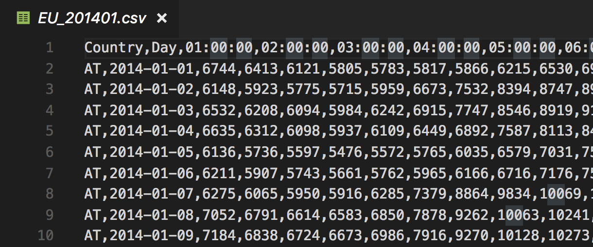
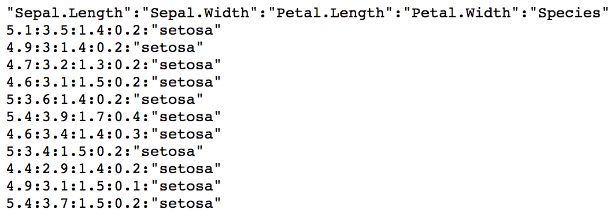

# 資料載入

## 資料格式

- csv 純文字
- txt 純文字
- excel 試算表

# csv 純文字

## csv 純文字簡介

- comma-separated values
- 以 `,` 分割變數的文字檔
- 使用 `read.table()` 函數或者 `read.csv()` 函數載入

## csv 純文字的檔案外觀



## 使用 read.table() 函數

```{r}
url <- "https://storage.googleapis.com/r_rookies/iris.csv" # 在雲端上儲存了一份 csv 檔案
iris_csv_df <- read.table(url, sep = ",", header = TRUE)
head(iris_csv_df)
```

## 使用 read.csv() 函數

```{r}
iris_csv_df <- read.csv(url)
head(iris_csv_df)
```

# txt 純文字

## txt 純文字的外觀



## 使用 `read.table()` 函數

```{r}
url <- "https://storage.googleapis.com/r_rookies/iris.txt" # 在雲端上儲存了一份 txt 檔案
iris_colon_sep_df <- read.table(url, sep = ":", header = TRUE)
head(iris_colon_sep_df)
```

# excel 試算表

## 安裝 readxl 套件

```r
install.packages("readxl")
```

```{r}
library(readxl)
```

## 使用 read_excel() 函數

https://storage.googleapis.com/r_rookies/iris.xlsx

```{r}
download_path <- "~/Downloads/iris.xlsx"
iris_xlsx_df <- read_excel(download_path)
head(iris_xlsx_df)
```

# 資料寫出

## write.csv 函數

```r
load(url("https://storage.googleapis.com/r_rookies/straw_hat_df.RData"))

write.csv(straw_hat_df, file = "~/learn-r-ntub/straw_hat.csv", row.names = FALSE)
```