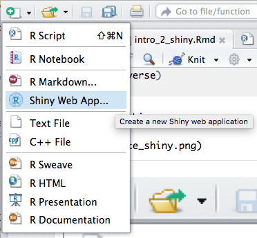
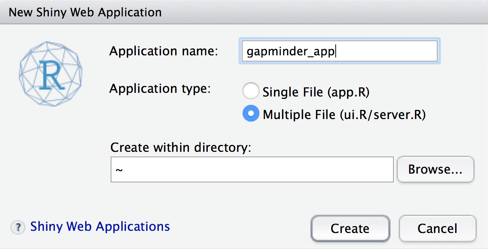

# 準備事項

## 安裝與載入

```
install.packages("shiny")
install.packages("plotly")
install.packages("gapminder")
install.pacakges("tidyverser")
```

```{r message=FALSE}
library(shiny)
library(plotly)
library(gapminder)
library(tidyverse)
```

## 建立一個 shiny app



## 命名資料夾



## 資料夾內容結構

一個 Shiny App 基本會包含以下的元件：

- `ui.R`
- `server.R`
- `global.R`(optional)

## 各元件負責不同的事情

|元件|職責|
|----|----|
|ui.R|前端介面|
|server.R|後端資料傳輸設計|
|global.R|處理前端後端都可以取用的函數或物件|

# Gapminder App

## global.R

```{r eval=FALSE}
# global.R template for Plotly/Shiny apps

library(plotly)
library(shiny)
library(gapminder)
library(magrittr)
library(dplyr)

py <- plot_ly(username="rAPI", key="yu680v5eii")

source("plotlyGraphWidget.R")
```

## ui.R

```{r eval=FALSE}
continent_list <- gapminder$continent %>%
  as.character() %>%
  unique()

# Define UI for application that mimics a Gapminder visualization
shinyUI(fluidPage(
  
  # Application title
  titlePanel("Gapminder Visualization"),
  
  # Sidebar with a slider input for year 
  sidebarLayout(
    sidebarPanel(
      checkboxGroupInput("continents",
                         label = "Continent:",
                         choices = continent_list,
                         selected = continent_list
                         )
    ),
    
    # Show a plot of the generated distribution
    mainPanel(
      plotlyOutput("bubble")
    )
  )
))
```

## server.R

```{r eval=FALSE}
# Define server logic required to draw a Gapminder visualization
shinyServer(function(input, output) {

  gapminder_data <- reactive(
    gapminder %>%
      filter(continent %in% input$continents)
  )
  output$bubble <- renderPlotly({
    
    # draw the bubble chart with the specified continents or year
    gapminder_data() %>%
      plot_ly(x = ~gdpPercap, y = ~lifeExp, color = ~continent, size = ~pop, type = "scatter", mode = "markers", sizes = c(10, 1000), text = ~country, frame = ~year) %>%
      layout(title = "Gapminder Data Visualization",
             xaxis = list(title = "GDP Per Capita", type = "log"),
             yaxis = list(title = "Life Expectancy"))
    
  })
  
})
```

## 在資料夾中額外置放兩個檔案

- [plotlyGraphWidget.R](https://storage.googleapis.com/intro2shiny/plotlyGraphWidget.js)
- [www/plotlyGraphWidget.js](https://storage.googleapis.com/intro2shiny/plotlyGraphWidget.R)

## {data-background-iframe="https://yaojenkuo.shinyapps.io/gapminder_app/"}